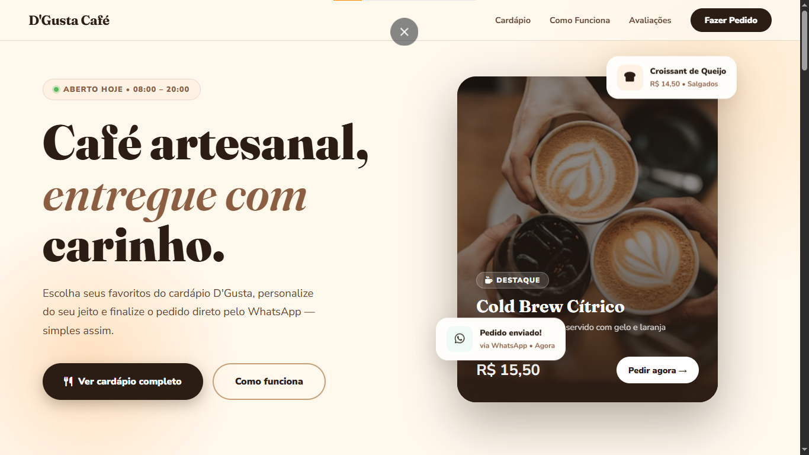
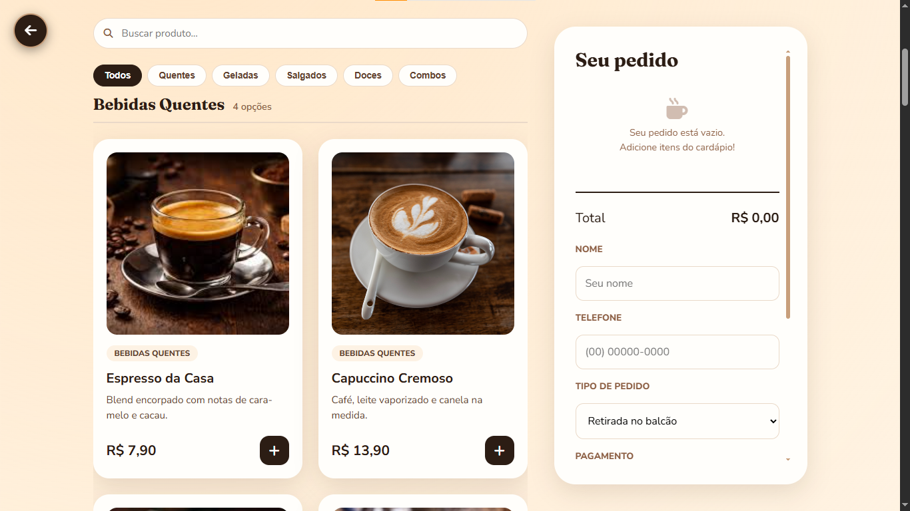
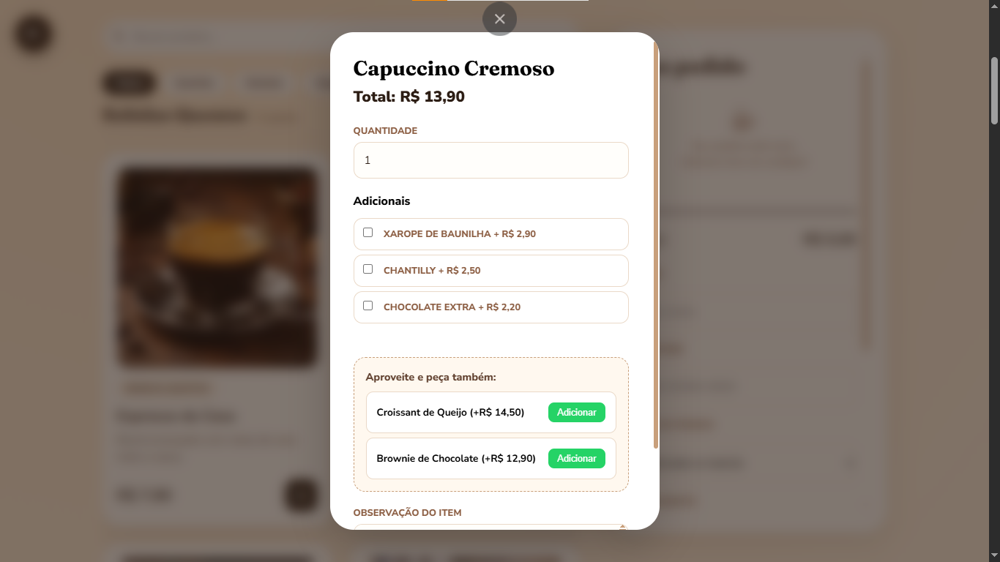
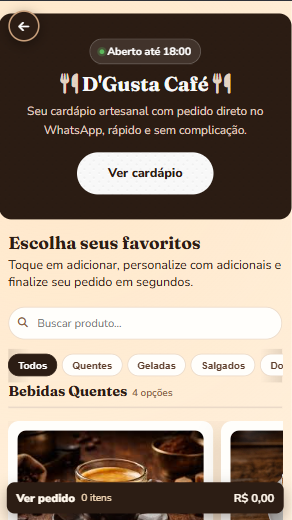

# D'Gusta Café

Cardápio online do D'Gusta Café, com navegação por categorias, personalização de pedidos e envio direto pelo WhatsApp.

## Aplicação em Produção
**Screenshots da aplicação em produção:**






## Tecnologias Utilizadas

- HTML5
- CSS3
- JavaScript
- Json
- Font Awesome
- Google Fonts

## Como Rodar Localmente

1. Clone o repositório:

	 ```bash
	 git clone https://github.com/GuuStav0/siteCardapio.git
	 ```

2. Acesse a pasta do projeto:

	 ```bash
	 cd siteCardapio
	 ```

3. Abra o arquivo `index.html` utilizando a extensão Live Server no VS Code ou XAMPP, não abrir manualmente pelo arquivo no navegador.

## Autores

- [Luiz Gustavo de Souza Sá](https://github.com/GuuStav0)
- [Murilo Dalaqua](https://github.com/dalaquamurilo804-sys)

## Estrutura do Projeto

```text
index.html
landing.html
schedule.json
assets/
	images/
	scripts/
		cart.js
		landing.js
		main.js
		products.js
		schedule.js
		ui.js
	styles/
		landing.css
		mainpage.css
```

## Observações
- O pedido é enviado pelo WhatsApp.
- Para trocar o número do WhatsApp, edite a constante `WHATSAPP_NUMBER` em [assets/scripts/main.js](assets/scripts/main.js).
- A landing page apresenta o cardápio e direciona para a página principal do pedido.
